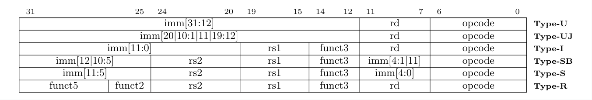

# Cyber-RISC-V simulator
### 硬件课程设计
---
- ***C/C++模拟RISC-V***
- ***实现32位机***
- ***实现RISC-V的六种指令格式***
- ***最终实现可以运行最基本的RISC-V程序***
---
#### 一、指令基本格式
*如下图所示为六种指令格式*
  

  - <font size=2.5>***opcode :指令操作码***</font>
  - <font size=2.5>***imm：代码立即数***</font>
  - <font size=2.5>***func3和funct7：代表指令对应的功能***</font>
  - <font size=2.5>***rs1：源寄存器1***</font>
  - <font size=2.5>***rs2：源寄存器2***</font>
  - <font size=2.5>***rd：目标寄存器（RSIC-V 一个指令可以提供三个寄存器操作）***</font>

#### 二、不同格式的指令的功能
| 序号 | 指令类型  | 作用                  |
|----|-------|---------------------|
| 1  | R 型指令 | 用于寄存器和寄存器操作|
| 2  | I 型指令 | 用于短立即数和内存载入指令load操作|
| 3  | S 型指令 | 用于内存存储store操作|
| 4  | B(SB) 型指令 | 用于有条件跳转操作 |
| 5  | U 型指令 | 用于长立即数操作|
| 6  | J(UJ) 型指令 | 用于无条件跳转操作 |

#### 三、寄存器
在RISC-V 的规范里面定义了32 个通用寄存器。其中31个是常规寄存器，1个恒为0值的x0寄存器。

如下表所示为寄存器

| 寄存器     | ABI 名称 | 说明                         |
|---------|--------|----------------------------|
| x0      | zero   | 0值寄存器，硬编码为0，写入数据忽略，读取数据为0  |
| x1      | ra     | 用于返回地址(return address)     |
| x2      | sp     | 用于栈指针（stack pointer）       |
| x3      | gp     | 用于通用指针 (global pointer)    |
| x4      | tp     | 用于线程指针 （thread pointer）    |
| x5      | t0     | 用于存放临时数据或者备用链接寄存器          |
| x6~x7   | t1~t2  | 用于存放临时数据寄存器                |
| x8      | s0/fp  | 需要保存的寄存器或者帧指针寄存器           |
| x9      | s1     | 需要保存的寄存器                   |
| x10~x11 | a0~a1  | 函数传递参数寄存器或者函数返回值寄存器        |
| x12~x17 | a2~a7  | 函数传递参数寄存器                  |
| x18~x27 | s2-s11 | 需要保存的寄存器                   |
| x28~x31 | t3~t6  | 用于存放临时数据寄存器                |

#### 四、需要实现的指令

- ***R型指令***
- 一共9条
  - <font size=2.5>***ADD 指令***
    - 格式：ADD rd,rs1,rs2 
    - 功能：rs1 + rs2 -> rd
  - <font size=2.5>***SUB 指令***
    - 格式：SUB rd,rs1,rs2 
    - 功能：rs1 - rs2 -> rd
  - <font size=2.5>***XOR 指令***
    - 格式：XOR rd,rs1,rs2 
    - 功能：rs1 ^ rs2 -> rd
  - <font size=2.5>***SRL 指令***
    - 格式：SRL rd,rs1,rs2 
    - 功能：(逻辑右移)rs1 >> rs2 -> rd
  - <font size=2.5>***OR 指令***
    - 格式：OR rd,rs1,rs2 
    - 功能：rs1 | rs2 -> rd
  - <font size=2.5>***AND 指令***
    - 格式：AND rd,rs1,rs2 
    - 功能：rs1 & rs2 -> rd
  - <font size=2.5>***SLL 指令***
    - 格式：SLL rd,rs1,rs2
    - 功能：(逻辑左移)rs1 << rs2 -> rd
  - <font size=2.5>***SLT 指令***
    - 格式：SLT rd,rs1,rs2
    - 功能：有符号数进行比较，若前者小于后者，那么将1保存到地址为rd的通用寄存器
  - <font size=2.5>***SRA 指令***
    - 格式：SRA rd,rs1,rs2
    - 功能：右移算术逻辑运算

- ***I型指令***
- 一共是9条
  - <font size=2.5>***LB 指令***
    - 格式：LB rd,imm(rs1)
    - 解释：从存储器种读出1个字节的数据按符号位扩展后，送入rd
    - 功能：M[rs1 + imm] -> rd
  - <font size=2.5>***LH 指令***
    - 格式：LH rd,imm(rs1)
    - 解释：从存储器种读出2个字节的数据按符号位扩展后，送入rd
    - 功能：M[rs1 + imm] -> rd
  - <font size=2.5>***LW 指令***
    - 格式：LW rd,imm(rs1)
    - 解释：从存储器种读出4个字节的数据按符号位扩展后，送入rd
    - 功能：M[rs1 + imm] -> rd
  - <font size=2.5>***LBU 指令***
    - 格式：LBU rd,imm(rs1)
    - 功能：取无符号1字节
  - <font size=2.5>***LHU 指令***
    - 格式：LHU rd,imm(rs1)
    - 功能：取无符号2字节
  - <font size=2.5>***ADDI 指令***
    - 格式：ADDI rd,rs1,imm
    - 功能：rs1 + imm -> rd
  - <font size=2.5>***XORI 指令***
    - 格式：XORI rd,rs1,imm
    - 功能：rs1 ^ imm -> rd
  - <font size=2.5>***ANDI 指令***
    - 格式：ANDI rd,rs1,imm
    - 功能：rs1 & imm -> rd
  - <font size=2.5>***ORI 指令***
    - 格式：ORI rd,rs1,imm
    - 功能：rs1 | imm -> rd

- ***S型指令***
- 一共是3条
  - <font size=2.5>***SB 指令***
    - 格式：SB rs1, imm(rs2)
    - 解释：存储字节，将通用寄存器里的低[7:0]位，存储到特定的地址单元
    - 功能：rs1 -> M[rs2 + imm]
  - <font size=2.5>***SH 指令***
    - 格式：SH rs1, imm(rs2)
    - 解释：存储字节，将通用寄存器里的低[15:0]位，存储到特定的地址单元
    - 功能：rs1 -> M[rs2 + imm]
  - <font size=2.5>***SW 指令***
    - 格式：SW rs1, imm(rs2)
    - 解释：存储字节，将通用寄存器里的低[31:0]位，存储到特定的地址单元
    - 功能：rs1 -> M[rs2 + imm]

- ***B型指令***
- 一共是6条
  - <font size=2.5>***BEQ 指令***
    - 格式：BEQ rs1, rs2, imm
    - 功能：rs1和rs2相等，则跳转PC+imm
  - <font size=2.5>***BNE 指令***
    - 格式：BNE rs1, rs2, imm
    - 功能：rs1和rs2不相等，则跳转PC+imm
  - <font size=2.5>***BGE 指令***
    - 格式：BGE rs1, rs2, imm
    - 功能：rs1大于等于rs2，则跳转PC+imm
  - <font size=2.5>***BLT 指令***
    - 格式：BLT rs1, rs2, imm
    - 功能：rs1小于rs2，则跳转PC+imm
  - <font size=2.5>***BLTU 指令***
    - 格式：BLTU rs1, rs2, imm
    - 功能：无符号rs1小于无符号rs2，则跳转PC+imm
  - <font size=2.5>***BGEU 指令***
    - 格式：BGEU rs1, rs2, imm
    - 功能：无符号rs1大于等于无符号rs2，则跳转PC+imm

- ***U型指令***
- 一共是2条
  - <font size=2.5>***LUI 指令***
    - 格式：LUI rd, imm
    - 功能：一个20位的立即数加载到寄存器rd的高20位，低12位为0
  - <font size=2.5>***AUIPC 指令***
    - 格式：AUIPC rd, imm
    - 功能：将一个20位立即数加到PC的高20位，生成一个32位地址
    - 例子：
        ```C++
        auipc t0, 0x12345 // 将PC的高20位加上0x12345存储到t0中
        addi t0,t0,0x678  // 将0x678加入t0中，得到全局变量地址0x12345
        ```

- ***J型指令***
- 一共是1条
  - <font size=2.5>***JAL 指令***
    - 格式：JAL rd, imm
    - 功能：将PC的值紧随其后的那条指令地址，存入rd寄存器中，然后将PC=PC+imm

#### 五、代码数据处理
- 读取MIPS代码
  - 去除所有的注释 ，“#”标识的后面的所有
  - 去除空行
  - 存储标号和及其的地址
  - 
  -  